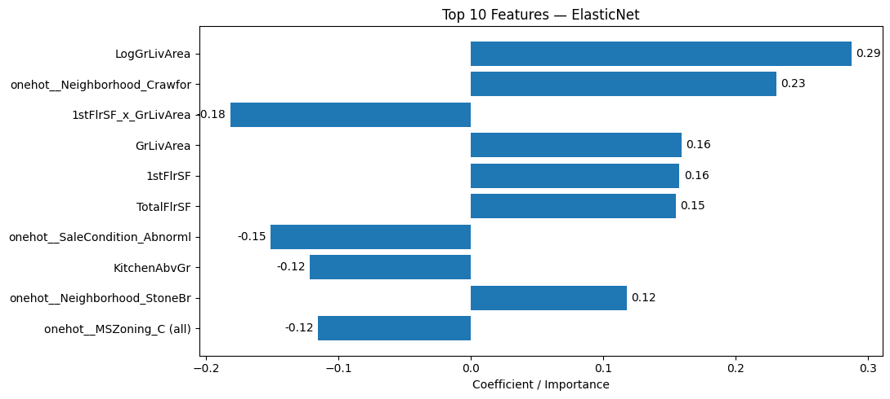
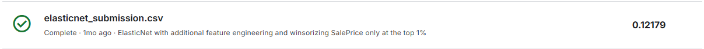
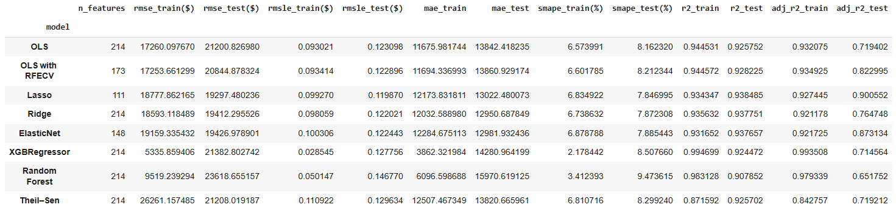
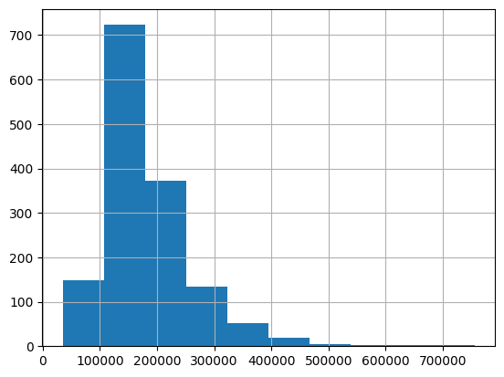
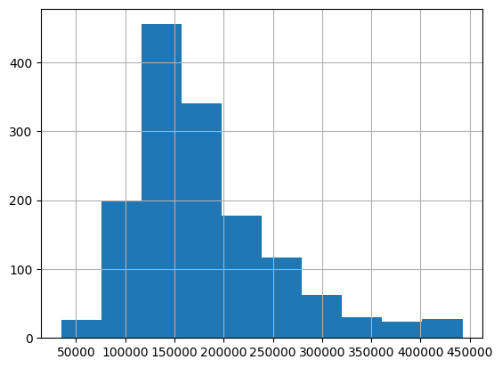
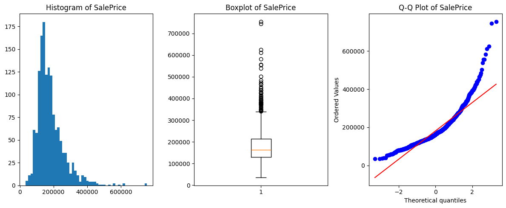
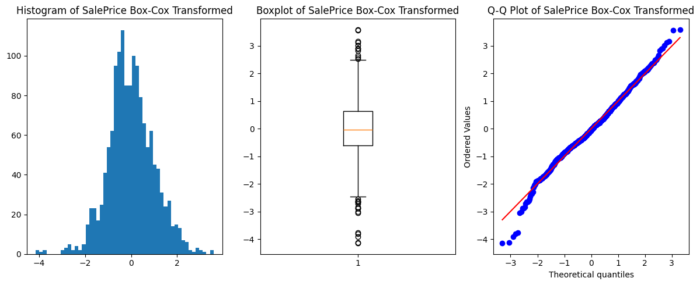

# House_Prices_Regression

## The original dataset can be found here: https://www.kaggle.com/competitions/house-prices-advanced-regression-techniques/data
## A Streamlit app can be found here: https://housepricesregression-8ckzvkpnywuezkrn7qgyxu.streamlit.app/

With rising demand and fluctuating market conditions, predicting house prices accurately remains a critical task for real estate agents, homeowners, and developers. The goal of this project is to build a regression model using the Ames housing dataset to forecast house sale prices based on various property features. This model can help inform pricing strategies, improve property valuation, and support decision-making for buyers and sellers.

## Results
- The best-performing model on the Kaggle leaderboard was Elastic Net, which yielded a public score of 0.12179. The model that best captured overall linearity was Lasso, with an adjusted R-squared value of 0.900552 and a public score of 0.12259.
  - More precisely, the public score is the root mean squared error (RMSE) between the logarithm of the predicted value and the logarithm of the observed sales price
  - The top 10 features are shown below:
    
- Several metrics for both the training and test datasets (from train-test splitting) for several other models include:
  - The number of features utilized in the model, n_features
  - Root Mean Squared Error (RMSE)
  - Root Mean Squared Logarithmic Error (RMSLE)
  - Mean Absolute Error (MAE)
  - Symmetric Mean Absolute Percentage Error (SMAPE)
  - R-squared
  - Adjusted R-squared

## Data Notes
- The dataset consists of four files, with the last two for reference purposes:
  - train.csv, the training data that contains 1460 observations with 80 features including the target SalePrice
  - test.csv, the test data that contains 1459 observations with 79 features without the target
  - data_description.txt, a text file that briefly describes each feature
  - sample_submission.csv, shows a sample submission for the Kaggle leaderboard
- Exploratory data analysis was done on house_prices_EDA.ipynb
- Data wrangling was done on house_prices_data_wrangling_winsor_top1.ipynb
  - For imputation, KNN imputation was done for numerical features, and the mode for categorical features
  - For categorical features, there were instances where some values appeared on the training dataset but not on the test dataset or vice-versa. One strategy used to address this is to concatenate the train and test datasets on top of each other and then proceed with encoding them to capture all possible values. However, this risks potential data leakage, so instead, categorical values were consolidated based on a numerical threshold
  - Some categorical features also had high cardinality (i.e. many unique values), so similarly, consolidation was done
  - For outliers in SalePrice, winsorizing the top 1% of observations helped reduce their influence and thereby improving the model's predective power, with before and after distributions shown below:
      
      
    
  - SalePrice was also Box-Cox transformed to help normalize its distribution, with before and after shown below:
      
      
- Extensive feature engineering was done, especially on the numerical features by creating new ones through:
  - Multiplying them together ("interactive" features), especially on ones correlated with each other the most
    - This helps better capture non-linearity
  - Applying logarithmic transformations to reduce skewness
  - Making new, more-interpretible ones such as simple boolean-valued or obtaining, for example, the house's age by subtracting the year sold by the year built
-  After feature engineering and encoding, 214 total features were yielded

## Model Notes
-  The training dataset was 80-20 train-test split
-  Eight total models were developed, including:
    - Ordinary Least Squares
    - Ordinary Least Squares with Reduced Feature Elimination with Cross-Validation
      - 173 features were subsequently utilized
    - Lasso
      - A 5-fold GridSearchCV was done on the alpha hyperparameter
    - Ridge
      - A 5-fold GridSearchCV was done on the alpha hyperparameter
    - Elastic Net
      - A 5-fold GridSearchCV was done on two hyperparameters, alpha and l1_ratio
    - XGBoost
      - A 5-fold GridSearchCV was done on five hyperparameters: n_estimators, learning_rate, max_depth, subsample, and colsample_bytree
    - Random Forest
      - A 5-fold GridSearchCV was done on five hyperparemeters: n_estimators, max_depth, min_samples_split, min_samples_leaf, and max_features
    - Thiel-Sen
- Each model was trained on Google Colab's L4 GPU

## Future Notes
- Try different models that can help better predict houses with outlier prices
- Try conducting a random grid search to save on time and computational cost
- Explore more ways to feature engineer to better capture non-linear relationships
- Apply more extensive logarithmic transformations to address skewed distributions and improve model robustness 
