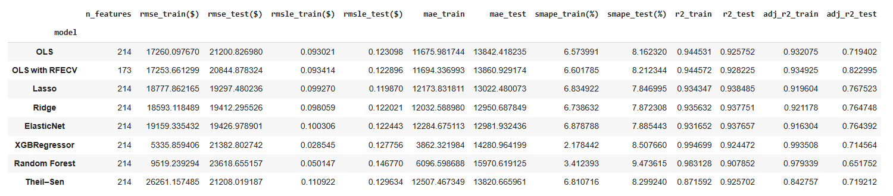

# House_Prices_Linear_Regression

## The original dataset can be found here: https://www.kaggle.com/competitions/house-prices-advanced-regression-techniques/data

With rising demand and fluctuating market conditions, predicting house prices accurately remains a critical task for real estate agents, homeowners, and developers. The goal of this project is to build a regression model using the Ames housing dataset to forecast house sale prices based on various property features. This model can help inform pricing strategies, improve property valuation, and support decision-making for buyers and sellers.

## Results
- The best-performing on the Kaggle leaderboard was Elastic Net

